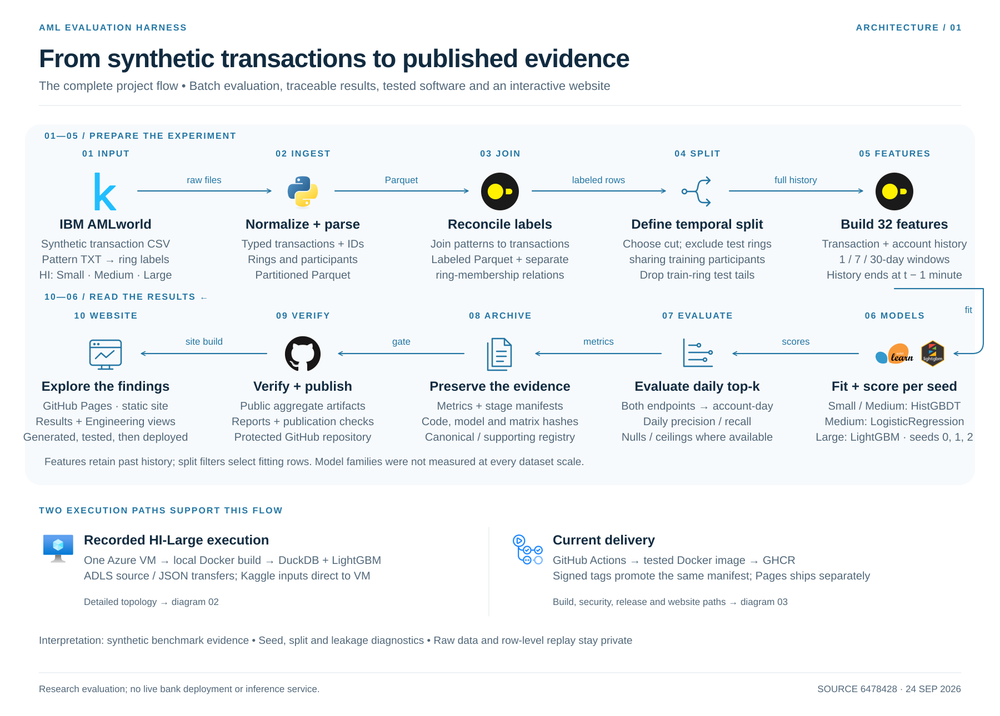

# AML evaluation harness

An alert-budget evaluation harness for transaction monitoring, built on IBM's
synthetic AMLworld benchmark. The subject is **evaluation methodology**, not
detection performance: how to report a top-k metric so that it measures a
ranker rather than the composition of the window it was measured on.

Anti-money-laundering review is capacity-constrained. A team can work a fixed
number of alerts a day, so the operative question is not "what is the AUC" but
"of the accounts we can afford to look at today, how many are worth looking
at". That makes the alert unit an **(account, calendar-day)** pair under a
daily budget `k`, and it makes every budget metric sensitive to how many
candidates and how many positives that day happened to contain.

The contribution is a set of reporting primitives that make a budget-constrained
number falsifiable — a random-ranker null, an attainable ceiling, and a
per-day check that the budget actually binds — together with the machinery to
prove a published figure came from a specific run: manifests, content-addressed
code provenance, replay bundles, and a publication gate that refuses a number
no artifact supports.

---

## Architecture

[](aml-platform/docs/architecture/01-evaluation-pipeline.svg)

Three views, each a separate diagram, because they describe three different
things and conflating them has caused real errors here:

| view | what it shows |
|---|---|
| [Data, models and evaluation](aml-platform/docs/architecture/01-evaluation-pipeline.svg) | the pipeline above: raw transactions through features, the ring-aware split, the fits, and the account-day budget metrics |
| [Recorded Azure execution](aml-platform/docs/architecture/02-azure-execution.svg) | the topology the HI-Large run actually used |
| [CI and release](aml-platform/docs/architecture/03-ci-release.svg) | how the container is built, scanned, published and promoted today |

Sources, PNG versions and the icon attribution are in
[`aml-platform/docs/architecture/`](aml-platform/docs/architecture/README.md).

**The Azure view and the CI view are not the same path, and the HI-Large
result came from the first one.** That run predates the current release
pipeline: its image was **not** pulled from GHCR. The source was `git
archive`d at a fixed commit, hashed, uploaded to ADLS, and built into a
container **on the VM itself**, tagged `aml:<git-sha>`.

The two give different provenance guarantees. Current CI identifies the
published container by **registry digest**, and the release tag is the same
manifest bytes as the tested commit tag. The historical path verified the
application source by commit SHA and archive checksum and installed Python
dependencies from hashed wheels, but did not preserve enough to rebuild the
container bit-for-bit: the canonical `large_sorted_lgbm` manifests record
`code_git_sha` and a code tree hash and **no image digest**. That is source
provenance, not container reproducibility.

**The Azure diagram shows what was recorded as deployed, not the template.**
`aml-platform/infra/` declares more than was created — a NAT gateway and a
second public IP are in the Bicep and were not in the running group — and the
OS disk deployed as Premium where the template declares Standard.
`docs/RUNBOOK_cloud.md` records the divergence, and the cost table prices the
deployment rather than the template. Current Bicep must not be read as an
exact reconstruction of the historical resource group.

---

## Three findings

Each is scoped to one synthetic generator. None is a statement about real
money laundering or a production system.

### 1. The evaluated window crosses the generator's wind-down

Under **this project's** temporal protocol — a cut at `2022-09-10`, chosen by
the repository's own `split-sweep` diagnostic and set as a Makefile default,
not an official IBM split — the retained HI-Medium post-cut window spans the
point where the generator stops. Daily volume falls from 3,021,866 transactions
to 7, and daily laundering prevalence changes from 0.0008 to 0.4286.

The consequence is arithmetic, not opinion: on the pooled window a uniformly
random ranker already scores `precision@50` between **0.45392** and
**0.49147**, because on the thin days almost every candidate is positive. The
logistic model's pooled 0.57060 is **1.16x–1.26x** that null. A pooled
budget metric on this window is largely a statement about the window.

### 2. On the volume segment the signal is real, small, and bounded

Restricting to the seven days the generator was still running, the random-ranker
null drops to **0.00243–0.00244** and the 32-feature logistic model reaches
`precision@50` = **0.04286** — **15 true positives in 350 alert slots**.

That is observed enrichment in these ranked alert slots, not 350 independent
Bernoulli trials. The point estimate is **17.6x** the null. <!-- derived: 17.6 = 0.04286/0.00244, the head-segment precision over the adverse end of the random-ranker null -->
The largest attainable lift on this segment is **409.8x** — the reciprocal <!-- derived: 1/0.00244 -->
of the null, a property of the generator rather than of any ranker. No
binomial confidence interval is reported: the alerts are selected by rank and
clustered within seven days, so the independence assumption would be false.

### 3. Seed variance is large and mechanically localised

Across eight seeds on HI-Medium, `precision@50` spans **37.2%** of its mean
while ROC-AUC moves by 0.1%. Those fits use scikit-learn's histogram gradient
boosting; the seed changes the subsample used to estimate bin thresholds. A
separate three-seed LightGBM run on HI-Large shows **30.2%** variation, <!-- derived: (0.03238-0.02374)/((0.03238+0.02374+0.02973)/3) --> but it
was run with uncontrolled thread scheduling and is corroboration, not a clean
replication of the same mechanism. Reporting a
single-seed budget metric on this benchmark is not meaningful.

---

## Try the synthetic demo

No dataset required. This generates a small synthetic corpus, runs every
pipeline stage, cuts a replay bundle, and recomputes its metrics:

```bash
cd aml-platform && make setup && make replay-demo
```

The demo proves the **mechanism** composes end to end. It is not evidence
about the metric definitions: on a synthetic corpus of 6 test days the budget
never binds, so most of its numbers saturate. The load-bearing evidence is the
nine archived replay bundles, which are **not distributed** while their CDLA
status is unreviewed — see [`DATA_LICENSE.md`](DATA_LICENSE.md). Tests that
need them skip, by name.

---

## Reproducibility, in three tiers

| tier | needs | establishes |
|---|---|---|
| synthetic demo | a checkout | the pipeline composes; artifacts and manifests are written |
| aggregate verification | a checkout | every published figure traces to a committed artifact, checked by the publication gate |
| full replay | the licensed CSVs, or bundles regenerated from them | published budget metrics recompute exactly from stored rows |

`scripts/verify_replay_bundle.py` recomputes 42 budget metrics per bundle from
stored rows. The permutation null, the ring lift and the tail p-values are
**not recomputed** by it: a permutation moves scores across the top-k cut-off,
so the truncation argument that makes the stored rows sufficient for the budget
metrics has not been shown to extend to the null. Its **sufficiency** stops at
the metrics that read only `rank` and `y`.

Provenance is **content-addressed for code** — package tree hashes, generator
blob hashes, environment lock hashes — and **recorded/metadata-addressed for
large data inputs**, which are keyed by path, size and mtime rather than by
content. A same-size, mtime-preserving edit would evade that boundary. This is
not full content-addressed provenance and is not described as such.

---

## Methods

- **Alert unit.** `(account, calendar-day)`. A transaction contributes an
  account-day to both endpoints; score and label are the per-day maximum.
- **Split.** Temporal cut, plus ring-participant disjointness: rings straddling
  the cut are dropped so no ring participant appears on both sides. This
  removes a large and non-representative ring population, so every level is
  conditional on the surviving rings.
- **Nulls.** A uniformly random ranker, computed per day and slot-weighted; and
  a within-day permutation null for ring coverage. The permutation null
  conditions on the model's own per-day score multiset, so it measures score
  *placement*, not ring detection skill.
- **Ceilings.** `recall_ceiling@k = sum_d min(P_d, k) / P`, reported beside
  every recall, and `nonbinding_days@k` as a precondition — where the budget
  does not bind, precision equals that day's prevalence for any ranker.
- **Gate.** `make release-check` runs the suite, then refuses to publish a
  decimal that appears in no artifact, a value from a superseded lineage, or a
  value the retraction registry has withdrawn.

**Cloud.** The HI-Large rung — 179,702,229 transactions, a 124,992,128 x 32
training matrix — ran on an Azure VM. The container was **not** pulled from a
registry: `scripts/provision_vm.sh` builds it on the VM from a `git archive` of
a fixed commit, uploaded to ADLS Gen2 and checked against a recorded SHA-256
before the build, and tags it `aml:<git-sha>`. Access used managed identity
with no stored secret, ADLS Gen2 with shared-key access disabled, and a DuckDB
spill disk. This identifies the application source used by the historical run;
it is not a claim that the complete historical container is bit-reproducible.
The GitHub Actions → GHCR path in the diagram above is the current distribution
mechanism for the published image; it is tested on every push, but it is not
what produced this result. Three seeds produced byte-identical training matrices. LightGBM fits in
14.9 GB where scikit-learn needs 33.5 GB and does not fit in 31.

---

## Limitations and non-claims

The full treatment is in [`LIMITATIONS.md`](aml-platform/docs/LIMITATIONS.md).
The boundaries that matter most:

- **One synthetic generator.** Nothing here transfers to real AML operations,
  and no bank, customer or case validation was performed.
- **Not a detector.** A 17.6x lift on seven days of synthetic data is a <!-- derived: 17.6 = 0.04286/0.00244, restated here as a non-claim -->
  diagnostic, not a product claim. This is a research harness, not a
  production system, and it has no bank, customer or case validation.
- **The ring lift does not measure ring skill.** Its null cannot separate a
  ring-blind account score from a ring-selective one; the direction is
  unidentified.
- **The added-feature ablation is not established.** Its four archived arms
  share one config hash, record no feature set, and two are byte-identical, so
  the archive cannot show which treatment produced which numbers. It is
  withdrawn from current conclusions pending regeneration.
- **No encoding effect was established.** Head-segment counts differ (14, 15
  and 18 of 350), every day-blocked Holm-adjusted test is non-significant, and
  6–7 blocking days cannot distinguish the arms.
- **The per-typology result is exploratory.** Post hoc, lineage-limited, and
  not quotable as a current model result.
- **The split contrast is descriptive.** HI-Small only, under an
  exchangeability assumption; not a causal estimate.
- **The cut is label-aware.** It was informed by ring-retention diagnostics, so
  it is a design choice, not an external protocol.

The publication gate is narrow by construction. It checks that a number exists
in an artifact — not that it measures what its sentence says. Roughly 96% of
random three-decimal values in [0,1) would pass its membership test, which is
measured and published rather than assumed.

---

## Documentation

| | |
|---|---|
| [Results](aml-platform/paper/) | per-experiment reports and their status |
| [Limitations](aml-platform/docs/LIMITATIONS.md) | what may and may not be claimed |
| [Related work](aml-platform/docs/RELATED_WORK.md) | prior art, and what is actually new |
| [Changelog](CHANGELOG.md) | releases and their errata |
| [Cloud runbook](aml-platform/docs/RUNBOOK_cloud.md) | the Azure deployment and its cost |
| [Engineering notes](aml-platform/docs/ENGINEERING_NOTES.md) | defects found and the boundaries of the provenance system |
| [Data licence](DATA_LICENSE.md) | AMLworld terms and what this repository distributes |
| [Architecture](aml-platform/docs/architecture/README.md) | the three diagrams, their sources and icon attribution |
| [Security](SECURITY.md) | reporting route, scope and the controls in place |
| [Releasing](aml-platform/docs/RELEASE_CHECKLIST.md) | what has to be true before a tag is cut |

## Verifying a release

```bash
cd aml-platform
make setup
make test                                       # 496 collected
python scripts/make_tables.py --check --gate    # every published number
python scripts/release_facts.py --check --gate  # every published count
```

**How many of those pass depends on what you have.** The raw AMLworld files and
the row-level replay bundles are not distributed, so the tests that need them
skip, by name, with the reason printed. In a clone holding neither, 32 skip and
the rest pass; on a machine with the dataset built out, fewer skip. Only the
*collected* count is quoted in documents here, because it is the one that does
not depend on where you are standing — the release notes carry the pass and
skip counts for the environment the release was verified in.

Every release is a signed tag. The container is published by digest, and the
release tag is the same manifest bytes as the tested commit tag.

## Licence

Code is MIT. AMLworld is CDLA-Sharing-1.0 and is **not** redistributed here;
see [`DATA_LICENSE.md`](DATA_LICENSE.md) for what each distribution contains.
