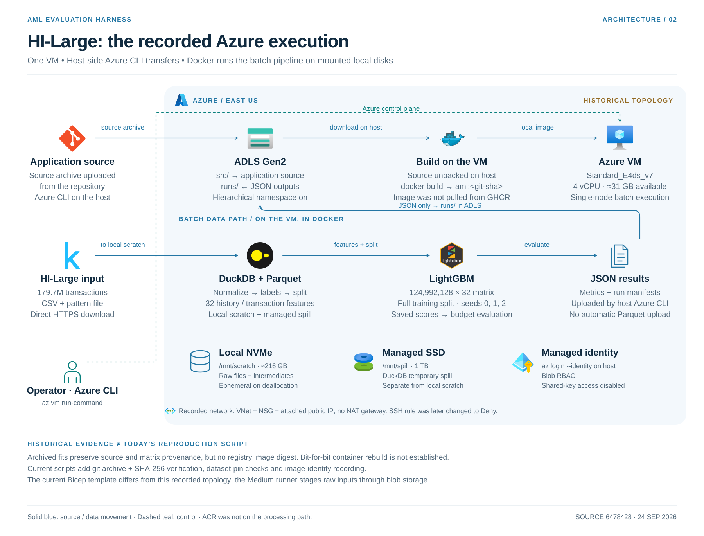
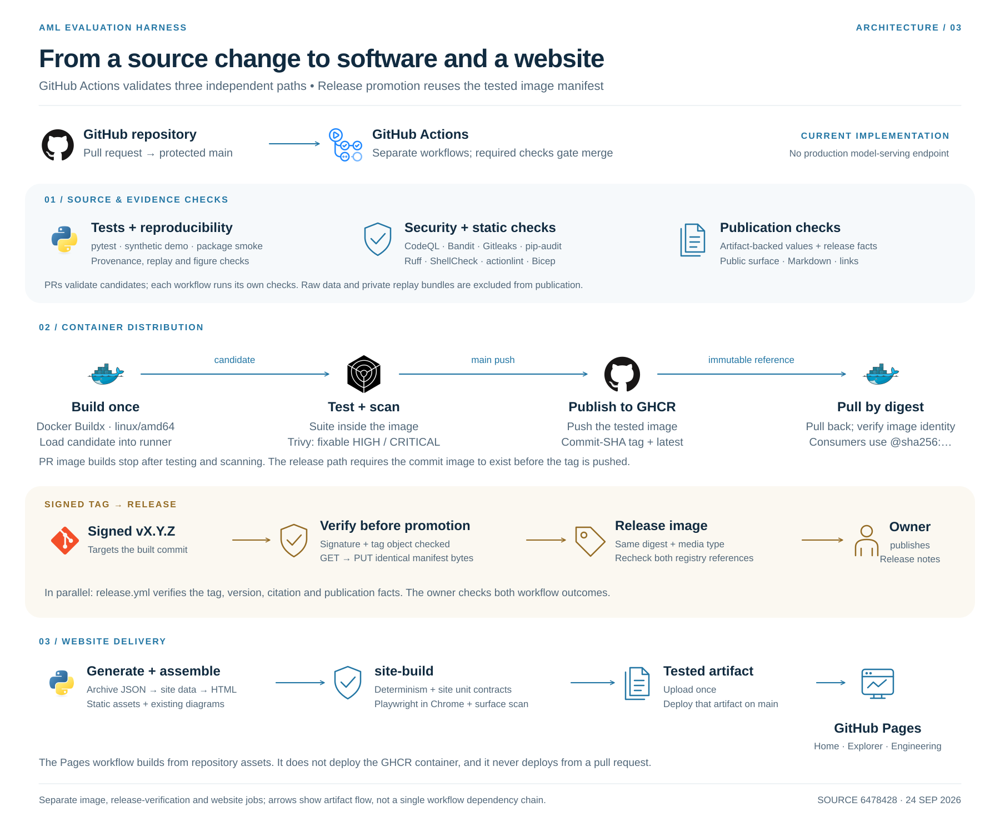

# Architecture diagrams

Three complementary views of the evaluation harness. Each uses the same light
theme, embedded technology icons and explicit flow labels. SVGs are editable and
self-contained; PNGs are 3,600 pixels wide for slides and documents.

## 1. Data, models and evaluation

[SVG](01-evaluation-pipeline.svg) · [PNG](01-evaluation-pipeline.png)


The numbered flow follows the pipeline's command order. Features are computed
from labeled transaction history; constructing the split does not truncate that
history. The trainer applies the temporal and ring filters when selecting rows.
Ring disjointness applies to participants in the assigned ring sets, not every
ordinary account appearing anywhere in the transaction table.

The model names correspond to the implementations: scikit-learn
`LogisticRegression` and `HistGradientBoostingClassifier`, and LightGBM
`LGBMClassifier` for the canonical HI-Large runs. The latter use the full training
split and seeds 0, 1 and 2. They are separate fits, not an ensemble shown here.

Account-day scores and labels each take their own maximum over the day's
transactions at both endpoints. Ring membership remains a separate many-to-many
relation. Budget metrics, transaction AP/AUC and ring coverage have different
units. The figure emphasizes the account-day budget metrics; it does not imply
that ring coverage establishes real-world detection ability. The publication
gate checks artifact support, not the truth of every surrounding interpretation.

## 2. Recorded Azure execution

[SVG](02-azure-execution.svg) · [PNG](02-azure-execution.png)



This view reconstructs the recorded HI-Large topology, rather than presenting
the current Bicep template as the exact deployed resource group. HI-Large inputs
download directly from Kaggle to the VM. The Medium runner instead stages its
inputs from blob storage. Source arrives through ADLS; JSON metrics and manifests
return to storage. Uploading those JSON files does not upload the model files,
Parquet intermediates or private replay rows automatically.

Azure CLI on the host handles blob access using managed identity. The batch
container works on mounted local paths. The storage abstraction also supports
remote URIs, but that is not the data path used for this scale run. The separate
managed spill disk prevents DuckDB temporary files from competing with raw and
intermediate data on local scratch. Scratch is ephemeral across deallocation.

The historical network had an attached public IP and no NAT gateway. Its SSH
rule was subsequently changed to Deny. A Premium OS disk and an unused ACR were
also recorded; they are omitted from the processing path. There is no Azure ML
workspace or distributed compute cluster in this architecture. Current Bicep
describes a different network and must not be treated as an exact reconstruction.

Current provisioning verifies a commit-derived source archive using SHA-256,
and current runners check dataset pins and record image identity. These are
reproduction safeguards. The historical fit manifests preserve source and matrix
provenance, but not a registry image digest. The source-era provisioning script
also contains defects later repaired. The diagram therefore does not assert
that today's full provisioning procedure ran unchanged in the historical run,
or that the historical container can be rebuilt byte-for-byte. It makes no
statement about whether cloud resources are running or billing today.

## 3. CI and release

[SVG](03-ci-release.svg) · [PNG](03-ci-release.png)



This view describes the workflow code reviewed on 22 September 2026, not a claim
that a particular candidate is released. Source, dependency, security and image
checks run in separate workflows. A PR tests the image without publishing it;
the branch image path pushes the tested image to GHCR and pulls it back to
check identity. Trivy's blocking scan excludes unfixed vulnerabilities, so its
success does not mean the image has no known vulnerabilities.

A release tag starts tag verification and image promotion independently.
Promotion reads the tested commit manifest, writes the same bytes under the
release tag and compares source and destination digests and media types.
`release.yml` verifies the signed tag and metadata; it does not create a GitHub
Release or enforce a dependency between those two workflows. The maintainer
checks both outcomes before publishing release notes. Ordinary build dispatches
and restricted promotion-probe dispatches also exist and are omitted for clarity.

## Source mapping

| Diagram detail | Repository evidence |
| --- | --- |
| Stage ordering | [Makefile](../../Makefile), [CLI](../../src/aml/cli.py) |
| Normalization and labels | [normalize.py](../../src/aml/ingest/normalize.py), [parse.py](../../src/aml/patterns/parse.py), [reconcile.py](../../src/aml/patterns/reconcile.py) |
| Ring split and historical features | [ring_aware.py](../../src/aml/splits/ring_aware.py), [build.py](../../src/aml/features/build.py) |
| Model definitions and row selection | [train.py](../../src/aml/models/train.py), [config.py](../../src/aml/models/config.py) |
| Account-day aggregation and metrics | [metrics.py](../../src/aml/eval/metrics.py) |
| Large model, matrix and seeds | [seed 0 manifest](../../results_archive/gold/large_sorted_lgbm_s0/manifest.json), [seed 1](../../results_archive/gold/large_sorted_lgbm_s1/manifest.json), [seed 2](../../results_archive/gold/large_sorted_lgbm_s2/manifest.json) |
| Large cut date | [split manifest](../../results_archive/gold/large_splits/manifest.json) |
| Cloud topology and deployment differences | [cloud runbook](../RUNBOOK_cloud.md), [Bicep](../../infra/main.bicep) |
| VM build, staging and JSON upload | [provision_vm.sh](../../scripts/provision_vm.sh), [run_hi_large.sh](../../scripts/run_hi_large.sh), [run_cloud.sh](../../scripts/run_cloud.sh) |
| Image build, scan and promotion | [image workflow](../../../.github/workflows/image.yml) |
| Tag verification | [release workflow](../../../.github/workflows/release.yml) |
| Tests, static and security checks | [CI](../../../.github/workflows/ci.yml), [gates](../../../.github/workflows/gates.yml), [security scan](../../../.github/workflows/security-scan.yml), [CodeQL](../../../.github/workflows/codeql.yml) |
| Publishable surface | [check_public_surface.py](../../scripts/check_public_surface.py) |

The canonical Large model source reference recorded in the manifests is
`b48ed9ff2b4a3d7da5f8440890eebba4114514fe`. It identifies application source, not
the exact deployed infrastructure or complete container environment.

## Icons and regeneration

Azure service icons come from Microsoft's
[official architecture icon pack](https://learn.microsoft.com/en-us/azure/architecture/icons/).
DuckDB uses its [official icon](https://duckdb.org/design/), and LightGBM uses its
[project logo](https://github.com/lightgbm-org/LightGBM/tree/main/docs/logo).
Other brand icons come from [Devicon](https://github.com/devicons/devicon) and
[Simple Icons](https://github.com/simple-icons/simple-icons). Their original
proportions and artwork are retained. Names appear beside the icons; placement
does not imply endorsement. Azure's Storage Account icon represents ADLS Gen2
with hierarchical namespace enabled; the Azure brand icon labels Azure CLI.

[sources.json](icons/sources.json) records each download URL and SHA-256.
[Icon notices](icons/NOTICES.txt) retain the relevant copyright and license terms.

Regenerate SVGs offline with the existing icon files:

```bash
python build_diagrams.py
```

For PNGs, install `@resvg/resvg-js@2.6.2` in a separate tools directory and run:

```bash
NODE_PATH=/path/to/tools/node_modules node render.cjs
```

`--fetch-assets` explicitly refreshes the downloaded icons and their checksums.
It is not needed for normal diagram edits. The diagrams do not change any model,
result artifact or runtime dependency.
